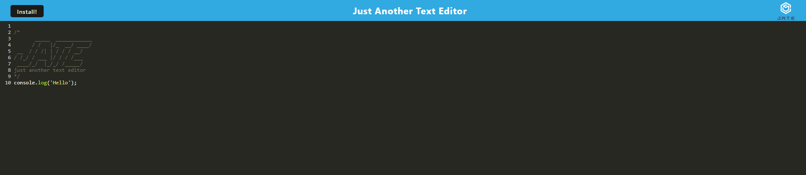

# PWA text editor

## Description 

This project is a Progressive Web Application (PWA) text editor specifically designed for developers to seamlessly write, edit, and store JavaScript code snippets and notes. It offers a client-server folder structure and ensures efficient development with automatic startup of the backend and client using a single command. The application uses Webpack to bundle JavaScript files and generate essential assets like HTML, a service worker, and a manifest file. With compatibility for next-generation JavaScript, the text editor functions flawlessly in the browser. IndexedDB is utilized for instant database storage and retrieval, ensuring content is preserved and accessible even after closing the application. Additionally, the PWA can be installed.

## Instalation

In order to install this PWA, open the application using the provided link to the deployed app, then click the install button in the upper left corner. You will be prompted with a message asking if you want to install the app. Press the "install" button in the prompt, and you're all set.

## Usage

In order to use this PWA, access the application using the provided link to the deployed app. Within the app, you can seamlessly write down JavaScript code snippets or notes in the text editor. The application automatically saves your content as you work, ensuring that your data is preserved for future reference. Enjoy the convenience of creating and storing your code snippets and notes effortlessly, whether you're online or offline. For additional convenience, you can install the PWA by following the instructions in the installation section.

## Screenshot displaying the deployed app

## URL to the deployed app

https://pwa-text-editor-c7xk.onrender.com/

## Credits

N/A

## Contributing

We welcome contributions to this project! To contribute, please follow these steps: 1. Fork the repository. 2. Create a new branch for your feature or bug fix. 3. Make your changes. 4. Test your changes locally. 5. Commit your changes with a clear commit message. 6. Push your changes to your fork. 7. Submit a pull request to the main repository's branch. Thank you for contributing to this project!

## License

MIT License

Copyright (c) 2024 fabricioGuac

Permission is hereby granted, free of charge, to any person obtaining a copy
of this software and associated documentation files (the "Software"), to deal
in the Software without restriction, including without limitation the rights
to use, copy, modify, merge, publish, distribute, sublicense, and/or sell
copies of the Software, and to permit persons to whom the Software is
furnished to do so, subject to the following conditions:

The above copyright notice and this permission notice shall be included in all
copies or substantial portions of the Software.

THE SOFTWARE IS PROVIDED "AS IS", WITHOUT WARRANTY OF ANY KIND, EXPRESS OR
IMPLIED, INCLUDING BUT NOT LIMITED TO THE WARRANTIES OF MERCHANTABILITY,
FITNESS FOR A PARTICULAR PURPOSE AND NONINFRINGEMENT. IN NO EVENT SHALL THE
AUTHORS OR COPYRIGHT HOLDERS BE LIABLE FOR ANY CLAIM, DAMAGES OR OTHER
LIABILITY, WHETHER IN AN ACTION OF CONTRACT, TORT OR OTHERWISE, ARISING FROM,
OUT OF OR IN CONNECTION WITH THE SOFTWARE OR THE USE OR OTHER DEALINGS IN THE
SOFTWARE.

## Questions

If you have any questions or need help with the project, feel free to contact me through the following channels: - Connect with me on GitHub at [fabricioGuac](https://github.com/fabricioGuac)  - Drop me an email at [guacutofabricio@gmail.com](https://github.com/guacutofabricio@gmail.com)   Don't hesitate to reach out if you need any clarifications or want to share feedback. I'm here to assist you!